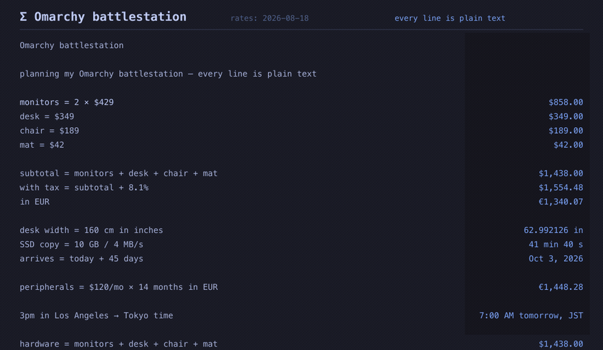

# Notepad Calc



A living calculation notepad for the Omarchy bar. Type prose with numbers; every line that is actually math evaluates as you type, and changing one number ripples through the sheet.

**Inspired by [Soulver](https://soulver.app).** The concept is Soulver's. This is a native, theme-aware, fully offline Omarchy implementation — not a clone of the product, and not affiliated with Acqualia.

The catalog already has one-shot `=expr` and a single-pair currency overlay. Notepad Calc's unit is the *sheet*: ten lines of budget math, each referencing the ones above, all live.

## Install

```sh
omarchy plugin add <git-url> --enable
```

Optional helper (daily ECB rate refresh). The plugin works without it — it ships a dated snapshot:

```sh
~/.config/omarchy/plugins/io.github.chris.notepad-calc/build.sh
```

Reload if the shell is already running:

```sh
omarchy-shell shell rescanPlugins
```

The chip lands in the bar's right section (`barWidget.defaultSection`). Move it with `omarchy bar move` if you want.

## Usage

Click the **Σ** chip (it shows the focused sheet's `total`). The first-run sheet is **Omarchy battlestation** — monitors, tax, EUR, desk width, a copy-time, a delivery date, and `$120/mo × 14 months in EUR`. Change `2 × $429` to `3 ×` and watch the downstream results pulse.

| Key | Action |
|---|---|
| Click Σ | Open / close the notepad |
| Esc | Close (or dismiss help / sheet switcher) |
| Ctrl+K | Sheet switcher |
| Ctrl+N | New sheet |
| Ctrl+Shift+C | Copy the result on the cursor line |
| Click a result | Copy that result |
| Ctrl+S | Save now (also autosaves on idle) |
| ? | Help |

The widget stays loaded on the bar, so Quattro `call` reaches it. Every `call` takes a final argument. Bind (the plugin does **not** write `hyprland.conf`):

```
bind = SUPER, N, exec, omarchy-shell shell call io.github.chris.notepad-calc toggle '{}'
bind = SUPER SHIFT, N, exec, omarchy-shell shell call io.github.chris.notepad-calc summon '{}'
bind = SUPER SHIFT, Escape, exec, omarchy-shell shell call io.github.chris.notepad-calc hide '{}'
```

`summon` / `hide` / `toggle` here are IpcHandler methods on the already-loaded bar widget, invoked through `shell call`. Host-level `shell summon|hide|toggle <id>` is for panel/overlay kinds and is not used for this widget.

## Grammar (v1, frozen)

Unknown words are prose, not errors. Anchors that turn a line into math: numbers, currency, units, operators, and reserved words (`in of per as from to ago sum total prev avg`).

```
rent = $1,200/mo
utilities = $180/mo
year cost = (rent + utilities) × 12          → $16,560.00
in EUR                                        → €14,275.86   (applies to prev; bundled 2026-08-18 rates)
20% of year cost                              → $3,312.00
year cost + 8.1% tax                          → $17,901.36
sum                                           → contiguous results above, to the last blank
$120/mo × 14 months in EUR                    → €1,448.28
10 GB / 4 MB/s                                → 41 min 40 s
3pm in Los Angeles → Tokyo time               → 7:00 AM tomorrow, JST
today + 45 days                               → Oct 3, 2026   (from 2026-08-19)
1440 minutes as hours                         → 24 h
```

- `X + N%` is Soulver's rule: `X × (1+N/100)`. The first-run sheet includes a tax line so you see it before you type it.
- `N% of X` multiplies.
- `in <unit|currency>` is a postfix conversion. Bare `in EUR` converts `prev`.
- Variables: `name = expr`. Names may contain spaces (longest match, defined-before-use). Redefinition shadows downward.
- Hover `sum` to underline exactly the lines it captured.
- Hover a timezone result to see the resolved IANA id (`America/Los_Angeles`, `Asia/Tokyo`).

Three-state lines:

| What you typed | Result column |
|---|---|
| No math anchors (`planning the desk`) | silent |
| Math plus a missing name (`budget = flights + hotl`) | muted `?hotl` |
| Resolvable | the value |

`version 2 of the plan` stays prose.

## Currency

ECB daily reference rates — about **30 currencies**, not 170. Cross-rates give more *pairs*, not more currencies. The header always shows `rates: YYYY-MM-DD`. Offline, you get the bundled snapshot. A background refresh runs **at most once per calendar day** (5s timeout, single-flight, atomic replace of `~/.local/share/notepad-calc/rates.json`). Network is an enhancement, never a dependency, and never blocks the UI.

## Files

```
~/.local/share/notepad-calc/sheets/*.calc   # plain text; first line is the title
~/.local/share/notepad-calc/rates.json      # last successful ECB pull
~/.local/share/notepad-calc/state.json      # last fetch date
```

Sheets are yours. Git them. Nothing proprietary can corrupt them.

Settings live **inline on the `shell.json` bar entry** (`defaultCurrency`). There is no plugin config file.

## Honest limitations

- **Grammar is frozen to the lines above and their compositions.** Natural-language improvisation will misfire; that is why the demo is the first-run sheet.
- **~30 ECB currencies.** No crypto, no exotic pairs, no live ticker.
- **~50 city / IANA zones**, DST-correct for 2024–2028 from bundled transition rules. City names are the documented form (`Los Angeles`, not `PST` in the demo). Ambiguous abbreviations (`IST`, `CST`) are refused rather than guessed.
- **130 canonical units** (UCUM-ish subset: length, mass, time, data, area, volume, speed, temperature, data-rate, angle, frequency).
- **`× 12` on a `$ /mo` quantity** treats 12 as twelve of that period so `(rent + utilities) × 12` is a year total. Prefer `× 12 months` if you want the unit algebra spelled out.
- **Row alignment** is wrap-free monospace. Long lines scroll horizontally; they do not wrap. That is deliberate.
- **Helper binary is optional.** Missing `bin/notepad-calc-rates` falls back to `compat/rates-refresh.sh` (curl), then to the bundled snapshot.
- **No second Quickshell process.** Everything runs inside `omarchy-shell`.
- **Keybinds are yours to add.**

## Tests

**This Mac cannot run Quickshell or Qt Quick.** Node is the local gate. QML UI, soak, and the fresh-machine demo run in Linux CI.

Local:

```sh
node tests/run.js                  # shared engine corpus (≥200 cases)
./build.sh && cargo test --manifest-path src/rates-refresh/Cargo.toml
compat/rates-refresh.sh fetch --xml tests/fixtures/ecb-daily.xml --out /tmp/rates-out.json
```

Linux CI (`.github/workflows/test.yml`, network disabled):

```sh
tests/run-qml.sh                   # same corpus under qml6
tests/ui/run.sh                    # loads Panel.qml, synthetic edits, grabToImage 1×/1.25×/2×, pixel-diff
tests/ui/demo.sh                   # fresh HOME, plugin install, battlestation demo
tests/ui/soak.sh                   # 500-line keystroke replay, RSS < 5MB, ≤1 rate attempt
```
